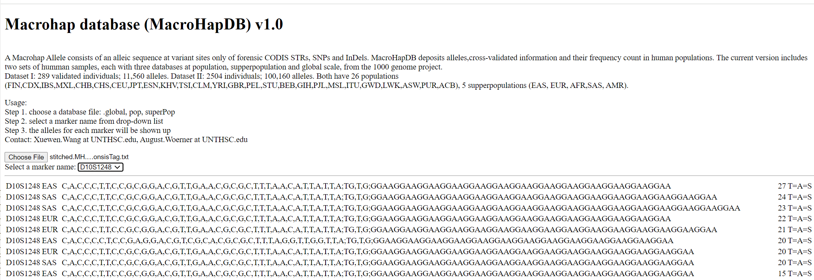

# MacroHapDB
  $${\color{blue}MacroHapDB \space is \space The \space DataBase \space of \space Macrohap \space Alleles}$$

An Macrohap Allele consists of an alleic sequence at variant sites only of forensic CODIS STRs, SNPs and InDels. VarAlleleDB deposits alleles,cross-validated information and their frequency count in human populations. The current version includes two sets of humman samples, each with three databases at population, supperpopulation and global scale, from the 1000 genome project. The coordinate position is based on HG38.

Dataset I: 289 validated individuals; 11,560 alleles. 

Dataset II: 2504 unrelated individuals; 100,160 alleles. 

Both have 26 populations (FIN,CDX,IBS,MXL,CHB,CHS,CEU,JPT,ESN,KHV,TSI,CLM,YRI,GBR,PEL,STU,BEB,GIH,PJL,MSL,ITU,GWD,LWK,ASW,PUR,ACB), 5 supperpopulations (EAS, EUR, AFR,SAS, AMR).

# Two types of database format

## Type A
   This type of database is in TAB separated text files and can be searched and viewed in the Internet browser using the tool provided here. 

## Type B
  This type database is in SQL format, which can be searched and used via SQL command. The tables in this MacrohapDB database contains all the files in text format in github, and a serial of short MH derived from the full-length macrohap dataset. The each subset MacrohapDB from 289 validated humans are in an separate table in the database named as:

  MH289supPop_300
  
  MH289supPop_500
  
  MH289supPop_1000
  
  MH289supPop_1500
  
  MH289supPop_2000
  
  MH289supPop_3000
  
  MH289supPop_4000
  
  MH289supPop_5000
  
  MH289supPop_6000
  
  MH289supPop_7000
  
  MH289supPop_8000
  
  mh289full

 There are five columns in each table. The column names  ['locus', 'population', 'macrohap', 'count', 'consistency']

 The SQL database MacrohapDB.sql is available on request.
 

 usage: SQL command to search and manipulate.
 
 ### example 1: 

 `mysql> SELECT * FROM mh289full LIMIT 2;`
 
    +--------+------------+-------------------------------------------------------------------------------------------------------------------------------------------------+-------+-------------+
    | locus  | population | macrohap                                                                                                                                        | count | consistency |
    +--------+------------+-------------------------------------------------------------------------------------------------------------------------------------------------+-------+-------------+
    | CSF1PO | EAS        | C,C,T,G,C,A,G,C,C,G,A,T,T,C,G,T,A,C,T,T,T,G,C,T,A,G,A,C,C,G,C,C,G,G,G,G,C,T,C,G,G,G,G,G;T,T,G;ATCTATCTATCTATCTATCTATCTATCTATCTATCTATCT          |    17 | T=A=S       |
    | CSF1PO | EAS        | C,C,T,A,C,G,G,C,C,C,A,T,T,C,G,T,A,C,T,T,T,G,C,T,G,A,A,C,C,G,C,C,G,G,G,G,C,T,T,C,G,A,G,G;T,T,GT;ATCTATCTATCTATCTATCTATCTATCTATCTATCTATCTATCTATCT |    12 | T=A=S       |
    +--------+------------+-------------------------------------------------------------------------------------------------------------------------------------------------+-------+-------------+
    2 rows in set (0.00 sec)

### example 2: for Europeians, search for the TPOX locus
`mysql> SELECT * FROM mh289full WHERE locus='TPOX' AND population='EUR' AND count >=10 LIMIT 2;`
    +-------+------------+----------------------------------------------------------------------------------------------------------------------------------------------------------------------------------------------------------------------------+-------+-------------+| locus | population | macrohap                                                                                                                                                                                                                   | count | consistency |
    +-------+------------+----------------------------------------------------------------------------------------------------------------------------------------------------------------------------------------------------------------------------+-------+-------------+
| TPOX  | EUR        | A,G,G,A,T,C,G,A,A,T,T,T,A,T,T,G,A,G,G,C,C,C,T,C,G,G,C,T,T,A,G,C,T,G,C,T,C,A,G,C,A,T,T,G,G,C,A,A,C,C,T,G,G,A,A,C,G,G,C,C,G,A,T,G,C,C,G,C,G,A,C,C,C,G,G,A,G,A,G,A,T,A,C,C;C,TAGTGGGG,CAGG,G;AATGAATGAATGAATGAATGAATGAATGAATG |    22 | T=A=S       |
    | TPOX  | EUR        | A,G,G,A,T,C,G,A,A,T,T,T,A,T,T,G,C,G,G,C,C,C,T,C,G,G,C,T,T,A,G,C,T,G,C,T,C,A,G,C,A,T,T,G,G,C,A,A,C,C,T,G,G,A,A,C,G,G,C,C,C,A,T,G,C,C,G,C,A,A,C,C,C,G,G,A,G,A,G,A,T,A,C,C;C,TAGTGGGG,CAGG,G;AATGAATGAATGAATGAATGAATGAATGAATG |    13 | T=A=S       |
+-------+------------+----------------------------------------------------------------------------------------------------------------------------------------------------------------------------------------------------------------------------+-------+-------------+
2 rows in set (0.01 sec)

 

  

# Installation
The VarAlleleDB can be directly run and viewed in any computer after downloading. No additional installation is required once an internet browser, e.g. Chrome, IE, Edge, firefox etc., is there. Users can use either method to install the database in a computer.

## Method 1: 
Download the files from github using the following command:

`git clone https://github.com/XuewenWangUGA/MacroHapDB`

Double click the viewer `MacroHapDB_viewer.html` in the downloaded folder to run the database.

## Method 2: 
Download the database compressed files from the github page and uncompress it. 

Then, double click the viewer `MacroHapDB_viewer.html` in the downloaded folder to run the database.

# Usage

Step 1. choose a database file: .global, pop, superPop

Step 2. select a marker name from drop-down list

Step 3. the alleles for selected marker will be shown up in a Tab separated text.

# Meaning of the columns 
The displayed alleles for each marker will have five columns, e.g., 

    CSF1PO	EAS	C,C,T,G,C,A,G,C,C,G,A,T,T,C,G,T,A,C,T,T,T,G,C,T,A,G,A,C,C,G,C,C,G,G,G,G,C,T,C,G,G,G,G,G;T,T,G;ATCTATCTATCTATCTATCTATCTATCTATCTATCTATCT	136	T=A=S

Meaning of each column:
1. column 1 is the marker/locus name, e.g., CSF1PO
2. column 2 is the population name, e.g., EAS
3. column 3 is the variant allele. SNPs, InDels and STRs separated by ";"
4. column 4 is the frequency count of this allele in the given population EAS
5. column 5 is the validated consistency information.T=A=S represents a consistency between three mathods.

Each variant is separated by ",". The position of each variant is provided in our Github depository https://github.com/XuewenWangUGA/VarSeqStitcher/tree/main/testData .

# Example
Here is an example for load the supper-population database.

Step 1. open the database file "stitched.MH.allele_count.1KG2504.supPop.consisTag.txt"

Step 2. click to choose the marker "CSF1PO" or any other marker name from the drop-down list

the variant allele will be displayed for the selected marker as shown in Fig1.

  Fig1.

# Util tools
Additional tools for processing and using the database.

## freqBasedAllelePicker

A python tool to generate macrohaps for an in silico man with the MacrohapDB alleles. The output is the MH alleles for the in silico man in evidence MH format and suspected MH format. 

example:
`python freqBasedAllelePicker.py -i MHtest2000.txt  -o MH_inSilicoMan`

      Input libray file is:   MHtest2000.txt
      Number of simulated DNA contributors:    1
      prefix of Output files:  MH_inSilicoMan

      This is in silico Macrohap alleles maker
      Results:
      MH allele in evidence format:   MH_inSilicoMan.MH.tsv
      MH allele in suspect format:    MH_inSilicoMan.MHs.tsv

### Usage: python freqBasedAllelePicker.py [options]
Download the tool and the test data from Util folder and then run the following command: 

` python freqBasedAllelePicker.py -i MHtest2000.txt -m 1 -o MH_inSilicoMan `

  Options:
  
            -h, --help: show this help message and exit
            
            -i, --input: a required file of macrohap database
            
                        #database format (tab separated):
                        
                    CSF1PO  EAS     C,C,T,G,C,A,G;;ATCTATCTATCTATCTATCTATCTATCTATCTATCTATCT 29      T=A=S
                    
                    CSF1PO  EAS     C,C,T,G,C,A,G;;ATCTATCTATCTATCTATCTATCTATCTATCTATCTATCTATCT     28      T=A=S
                    
            -m, --mix: integer >=1, the number of individuals in simulated DNA evidenced mixture, default 1
            
            -o, --out, prefix of file name. Results are the tab delimited allele data in evidence and suspect format.
            
                    #suspect format (tab separated):
                    
                    TH01    C,C,T,T,G,T,C,G,G,G,C,C;G;AATGAATGAATGAATGAATGAATGAATG  1
                    
                    TH01    C,T,C,T,G,T,G,G,G,G,A,C;G;AATGAATGAATGAATGAATGAATG      1
                    
                    TPOX    C,G,A,T,G,C,C,G,C,G,A,C,C,C,G,G,A,G;G;AATGAATGAATGAATGAATGAATGAATGAATG  2
                    
                    #Evidence format: similar to suspect format but no the 3rd column
                    
    Version: 1.0.0, Mar,18th,2024

# Funding
This work was sponsored in part by award 15PNIJ-21-GG-04159-RESS, awarded by the National Institute of Justice, Office of Justice Programs, U.S. Department of Justice.

# Support

Contact: Xuewen.Wang at UNTHSC.edu, August.Woerner at UNTHSC.edu

